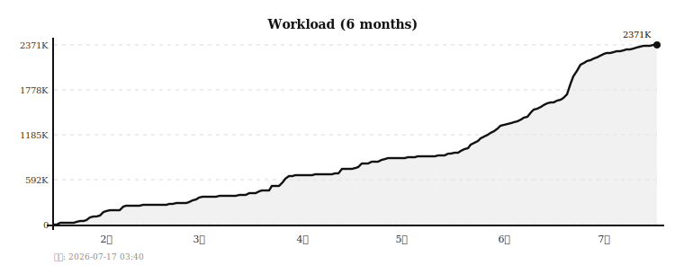
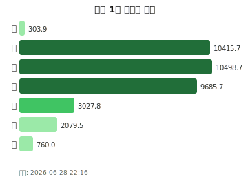
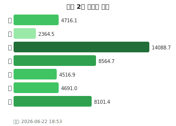
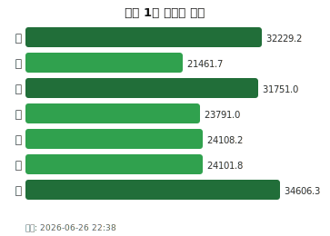
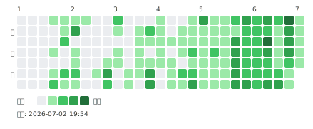

# 🏢 AI개발부 AI솔루션 Cell

> 조직 전체 리포지토리 커밋 활동 현황 (매일 자동 갱신)  
> 활동 점수 = 커밋 1점 + 라인 변경량/50 (상한 10점)

## 📂  전체 리포지토리 Workload 추이

## 📊 활동 현황

<table>
<tr>
<td align="center" width="50%"><b>최근 1주</b>  
<picture>
  <source media="(prefers-color-scheme: dark)"  srcset="./heatmap_1w_dark.svg">
  <source media="(prefers-color-scheme: light)" srcset="./heatmap_1w_light.svg">
  
</picture></td>
<td align="center" width="50%"><b>최근 2주</b>  
<picture>
  <source media="(prefers-color-scheme: dark)"  srcset="./heatmap_2w_dark.svg">
  <source media="(prefers-color-scheme: light)" srcset="./heatmap_2w_light.svg">
  
</picture></td>
</tr>
<tr>
<td align="center" width="50%"><b>최근 1달</b>  
<picture>
  <source media="(prefers-color-scheme: dark)"  srcset="./heatmap_1m_dark.svg">
  <source media="(prefers-color-scheme: light)" srcset="./heatmap_1m_light.svg">
  
</picture></td>
<td align="center" width="50%"><b>연간 히트맵 (최근 6개월)</b>  
<picture>
  <source media="(prefers-color-scheme: dark)"  srcset="./heatmap_dark.svg">
  <source media="(prefers-color-scheme: light)" srcset="./heatmap_light.svg">
  
</picture></td>
</tr>
</table>
